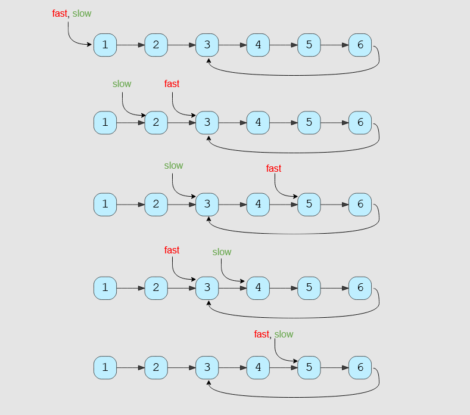

# Introduction

The Fast & Slow pointer approach, also known as the *Hare & Tortoise algorithm*, is a pointer algorithm that uses two pointers which move through the array (or sequence/LinkedList) at different speeds. This approach is quite useful when dealing with cyclic LinkedLists or arrays.

By moving at different speeds (say, in a cyclic LinkedList), the algorithm proves that the two pointers are bound to meet. The fast pointer should catch the slow pointer once both the pointers are in a cyclic loop.

One of the famous problems solved using this technique was *Finding a cycle in a LinkedList*. Let’s jump onto this problem to understand the *Fast & Slow* pattern.

# Solution

Imagine two racers running in a circular racing track. If one racer is faster than the other, the faster racer is bound to catch up and cross the slower racer from behind. We can use this fact to devise an algorithm to determine if a LinkedList has a cycle in it or not.

Imagine we have a slow and a fast pointer to traverse the LinkedList. In each iteration, the slow pointer moves one step and the fast pointer moves two steps. This gives us two conclusions:

1. If the LinkedList doesn’t have a cycle in it, the fast pointer will reach the end of the LinkedList before the slow pointer to reveal that there is no cycle in the LinkedList.
1. The slow pointer will never be able to catch up to the fast pointer if there is no cycle in the LinkedList.

If the LinkedList has a cycle, the fast pointer enters the cycle first, followed by the slow pointer. After this, both pointers will keep moving in the cycle infinitely. If at any stage both of these pointers meet, we can conclude that the LinkedList has a cycle in it. Let’s analyze if it is possible for the two pointers to meet. When the fast pointer is approaching the slow pointer from behind we have two possibilities:

1. The fast pointer is one step behind the slow pointer.
1. The fast pointer is two steps behind the slow pointer.

All other distances between the fast and slow pointers will reduce to one of these two possibilities. Let’s analyze these scenarios, considering the fast pointer always moves first:

1. *If the fast pointer is one step behind the slow pointer*: The fast pointer moves two steps and the slow pointer moves one step, and they both meet.
1. *If the fast pointer is two steps behind the slow pointer*: The fast pointer moves two steps and the slow pointer moves one step. After the moves, the fast pointer will be one step behind the slow pointer, which reduces this scenario to the first scenario. This means that the two pointers will meet in the next iteration.

This concludes that the two pointers will definitely meet if the LinkedList has a cycle. A similar analysis can be done where the slow pointer moves first. Here is a visual representation of the above discussion:

